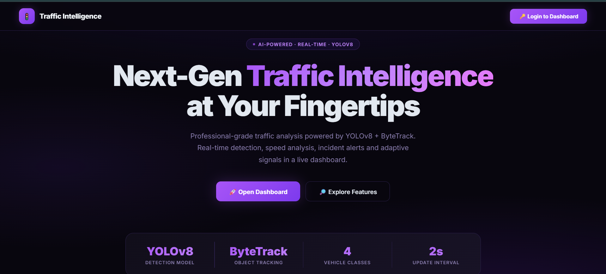

# 🚦 Traffic Intelligence — AI-Powered Traffic Analysis System

A professional-grade real-time traffic analysis system built with **YOLOv8**, **ByteTrack**, and **Flask**. Detects and tracks vehicles across user-defined lanes, computes per-lane statistics, flags incidents, measures speeds, and displays everything in a live web dashboard with a purple-black gradient UI.

---



## ✨ Features

| Feature | Description |
|---|---|
| 🎯 Multi-Object Tracking | ByteTrack algorithm with unique vehicle IDs |
| ⚡ Lane-Level Analytics | Per-lane counts, LOS A–F grading, flow rate, queue length |
| 📷 Speed Camera | Pixel-to-meter calibrated speed estimation + violation logging |
| ⚠️ Incident Detection | Flags stopped vehicles (>5s) with live alerts |
| 🚨 Emergency Priority | Auto signal timer extension for emergency vehicles |
| 📊 Live Chart History | 2-minute rolling bar/line chart (Chart.js) |
| 🔥 Heatmap Overlay | Accumulative density heatmap via OpenCV |
| 📈 Trend Prediction | Rolling linear regression per lane |
| 💾 CSV Data Logging | Every detection exported for offline analysis |
| 🔐 Auth-Protected Dashboard | Login-gated live dashboard with session management |

---

## 🚀 Getting Started

### 1. Clone the repo
```bash
git clone https://github.com/YOUR_USERNAME/traffic-intelligence.git
cd traffic-intelligence
```

### 2. Install dependencies
```bash
pip install -r requirements.txt
```

### 3. Set your credentials
Copy the example env file and fill in your own values:
```bash
cp .env.example .env
```
Edit `.env`:
```
DASH_USER=your_username
DASH_PASS=your_password
```

### 4. Add your video file
Place your traffic video in the project folder and update `VIDEO_PATH` in `traffic_v2.py`:
```python
VIDEO_PATH = "your_video.mp4"
```

### 5. Run
```bash
python traffic_v2.py
```

Then open **http://localhost:5050** in your browser.

---

## 🛠️ Tech Stack

- **Python** — core logic
- **YOLOv8** (Ultralytics) — vehicle detection
- **ByteTrack** (Supervision) — multi-object tracking
- **OpenCV** — video processing & heatmap
- **Flask** — web server & REST API
- **Chart.js** — live dashboard charts

---

## 📁 Project Structure

```
traffic-intelligence/
├── traffic_v2.py       # Main application
├── requirements.txt    # Python dependencies
├── .env.example        # Credential template (copy → .env)
├── .gitignore
└── README.md
```

> **Note:** Your `.env`, video files (`*.mp4`), model weights (`*.pt`), and CSV logs are excluded from the repo via `.gitignore`.

---

## 📄 License

MIT License — free to use and modify.

---

*Built by Varnit*

